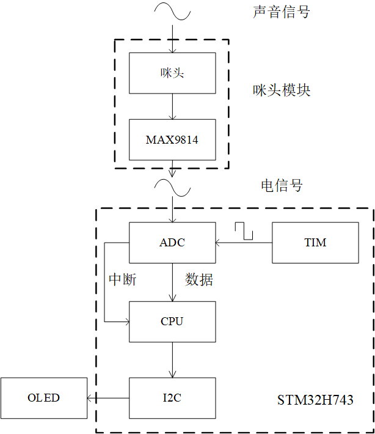
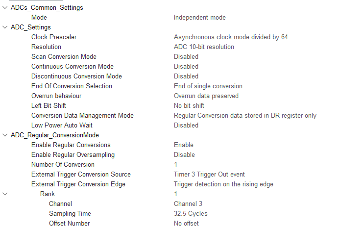
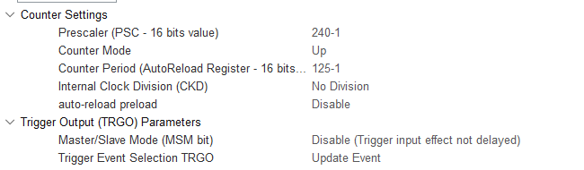
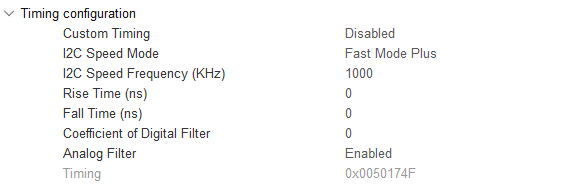

# 基于STM32和RT-Thread的音频信号频谱分析系统

> **摘要**：频谱分析是信号处理的重要方法之一，频域和时域之间的转换一般通过傅里叶变换/傅里叶逆变换 实现。在数字域中通常采用DFT来替代傅里叶变换来对信号做频谱分析。本设计基于STM32H743单片机，利用基于MAX9814的咪头模块将音频信号转换为电信号，使用单片机SoC中的ADC对的输出信号进行采集，并使用基于I2C通信的0.96寸OLED显示频谱。软件方面，使用了近年来业界评价较好的国产RTOS——RT-Thread操作系统，并移植ARM官方的DSP库，并使用其中的FFT函数，对采集信号进行分析。RT-Thread引入了进程概念，本设计将程序分为两个线程，信号处理线程以及OLED显示驱动线程，并利用中断获取ADC数据。本设计最终实现了对音频信号做FFT，并将结果在OLED屏幕上可视化。
>
> 工程的GitHub仓库地址：https://github.com/edenhu1111/Spectrum-Analysys-of-Mic-Signal
>
> **关键词**：STM32H743, RT-Thread, ARM DSP 

## 1. 系统设计与参数选择

本设计的设计目标是使用STM32H743单片机，在RT-Thread操作系统中，对咪头采集的音频(本设计主要考虑音乐)信号作频谱分析，并将频谱分析的结果显示在OLED屏幕上。

### 1.1 系统架构

图1展示了本设计的系统架构。其中，咪头模块中咪头将声音信号转换为便于电子系统处理的电信号，美信公司的MAX9814用于将咪头直接输出的信号的放大。单片机利用SoC中的ADC实现模拟信号到数字信号的转换，为了保证ADC采样的周期性，使用通用定时器TIM产生的定时触发信号作为ADC采样的触发源。CPU采用中断的方式接收ADC采集的数据，经过FFT处理后的信号频谱以柱状图的形式显示在OLED屏幕上(柱状图越高，频谱的模越大)。OLED由I2C通信方式控制，本设计直接使用STM32的硬件I2C实现对OLED的驱动。

<b>图1</b> 系统框图

### 1.2 相关参数选择

音乐中的信号频率主要集中在300~3KHz，根据奈奎斯特采样定理和FFT相关知识，采样率必须高于6KHz，在此我们选择**8KHz**作为ADC的采样频率$$f_s$$。FFT的频率分辨率$$\Delta f=f_s/N$$，其中$$N$$为采样点数，且必须为2的整次幂。实数信号的FFT结果具有共轭对称的特点，所以实数FFT的输出只有一半是有效的，且有效分析的频率范围为DC-$$f_s/2$$。考虑到所使用的OLED宽为128个像素，显示柱状图的一个bar需要3列像素，且bar与bar之间需要1个像素作为间隔，在这里选择64点FFT最为合适。由于低频成分和部分高频成分在本设计中被忽略，在32个点中只选择第2到第26点(共25个点，序号从0开始)显示在OLED上。

## 2. 系统的实现

基于上一章的内容，本章介绍了系统的具体实现方法。本设计基于的开发板为ST的NUCLEO-H743ZI，开发工具为RT-Thread Studio, STM32CUBEMX。

### 2.1 SoC外设初始化

STM32的外设初始化代码可以通过CUBEMX生成。由上一章可知，需要初始化的外设主要有三个，分别为ADC、TIM以及I2C。本小节介绍了基于上一章的需求和参数，SoC外设的配置方式。

#### 2.1.1 ADC初始化

下面根据图2解释ADC初始化中较为关键的一些配置。Clock Prescaler为时钟预分频，Synchronous clock指的是APB总线时钟，Asynchronous clock指由锁相环PLL2P输出的时钟，在这里选择Asynchronous clock mode divided by 64，即说明ADC时钟采用的是PLL2P输出的150MHz时钟信号被64分频后的信号。在这里由于采样率较低，无须刻意选择，只要保证转换时间小于采样周期即可。Resolution为分辨率，由于本设计只是粗略地展示信号频谱，对ADC分辨率要求也不高，此处选择10bit即可。Scan Conversion Mode一般用于多通道采样的情况，此处只用到了一个通道，故失能。Continuous Conversion Mode和Discontinuous Conversion Mode都设置为失能，<u>使能前者会使得ADC在被TIM触发了一次后，以一个极快的采样率持续采样</u>，与我们的需求不符，后者则用于多通道情况，使得每次触发只有部分通道采样，也与需求不符。End Of Conversion Selection确定转换结束的标志，即进入ADC中断的标志，在这里由于只有单通道，End Of Single Conversion与End of Sequence Conversion是等效的。ADC Setting中的其他设置均选择默认设置即可。External Trigger Conversion Source 选择Trigger 3 Trigger Out Event，此处Trigger3中的3即为我们所使用的作为触发源的TIM的编号(TIM3)。rank表示通道的转换次序，此处无须关心。sampling time表示转换时间，其单位的cycles为ADC时钟的周期而并非触发源的周期，转换时间越长，转换精度越高，此处选择32.5Cycles。实测该转换时间可以保证较为准确的测量结果。

<b>图2</b> CUBEMX中的ADC初始化设置

#### 2.1.2 TIM初始化

通用计时器TIM在本系统中主要用于生成ADC的采样时钟，其基本原理为通过调整计数器的模，将片内时钟总线的基准时钟分频。实现中使用的是通用定时器TIM3，由于其时钟源APB2时钟的频率为240MHz，所以需要对其作30000分频以获取8KHz的采样时钟。CUBEMX配置如图3所示。Prescaler设置为240-1，即先对APB2的时钟信号作240预分频，计数器周期设置为125-1，即计数器的模为124，实现对预分频后的时钟的125分频。同时要设置TRGO，在TIM每次溢出时产生一个事件(Event)，用于作为ADC的触发。

<b>图3</b> CUBEMX中的TIM初始化设置

为了方便测试触发周期是否正确，可以配置一个计时器的通道为PWM输出模式，通过测量输出的PWM信号的频率以获得触发频率。

#### 2.1.3 I2C初始化

I2C总线是由Philips公司开发的一种简单、双向二线制同步串行总线。它只需要两根线(SDA,SCL)即可在连接于总线上的器件之间传送信息。I2C标准模式下速度为100Kb/s，快速模式下速度为400kb/s，STM32H743ZI的硬件I2C支持Fast Mode Plus模式，最大传输速率可达到1000Kbit/s。由于OLED的驱动信号是以串行的方式输入，系统将I2C速率设置为1000kb/s以保证刷新率足够高。图4为CUBEMX中对I2C的初始化配置，由于较为简单明了，在此不多加解释。

<b>图4</b> CUBEMX中的I2C初始化设置

### 2.2 线程配置

#### 2.2.1 线程的基本设置

#### 2.2.2 利用信号量保证变量同步

### 2.3 DSP库移植与使用

#### 2.3.1 DSP库移植

#### 2.3.2 FFT函数的使用

### 2.4 OLED驱动

#### 2.4.1 OLED驱动基本原理

#### 2.4.2 OLED显示柱状图流程

## 3. 运行效果

## 4. 结论

> **参考文献**：
>
> [1] 
>
> [2] 