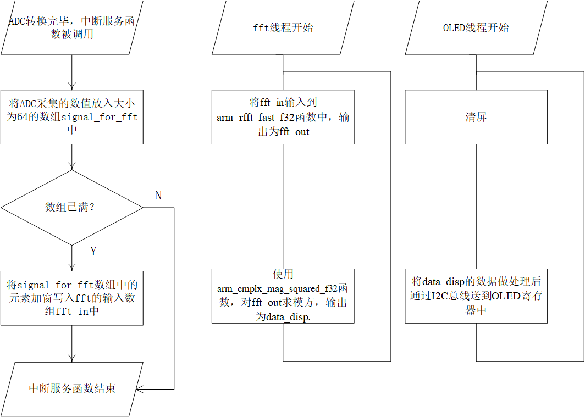
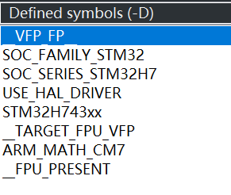
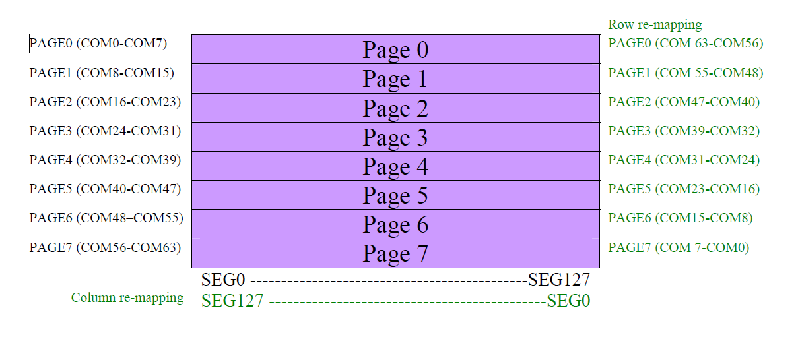
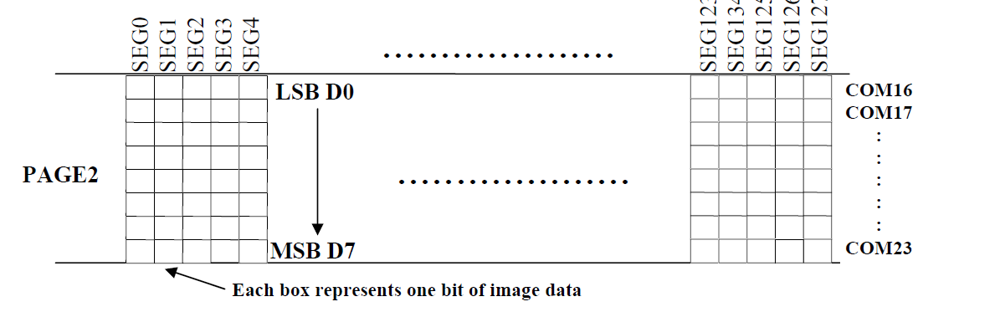
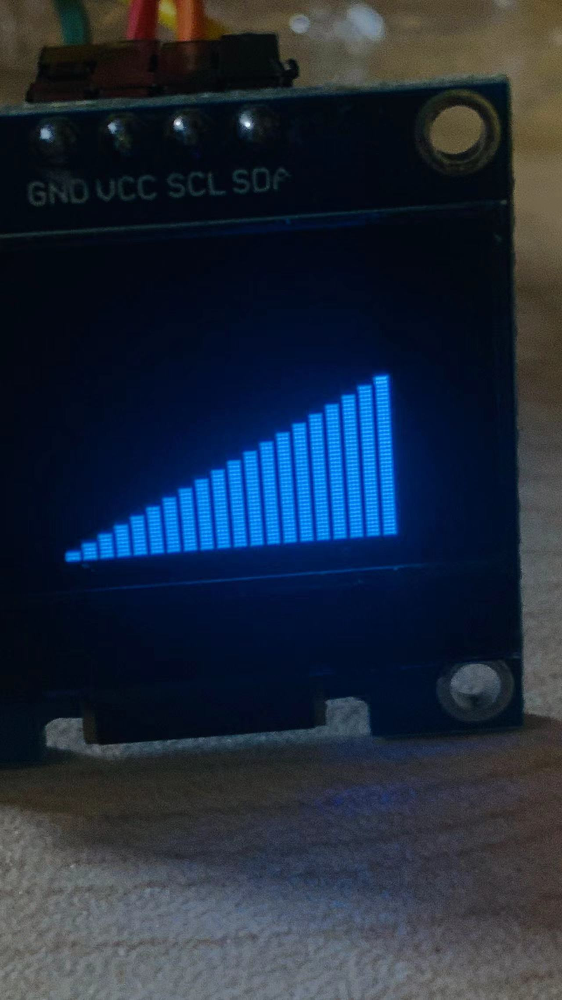
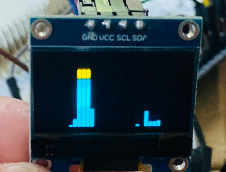

# 基于STM32和RT-Thread的音频信号频谱分析系统

> **摘要**：频谱分析是信号处理的重要方法之一，频域和时域之间的转换一般通过傅里叶变换/傅里叶逆变换 实现。在数字域中通常采用DFT来替代傅里叶变换来对信号做频谱分析。本设计基于STM32H743单片机，利用基于MAX9814的咪头模块将音频信号转换为电信号，使用单片机SoC中的ADC对的输出信号进行采集，并使用基于I2C通信的0.96寸OLED显示频谱。软件方面，使用了近年来业界评价较好的国产RTOS——RT-Thread操作系统，并移植ARM官方的DSP库，并使用其中的FFT函数，对采集信号进行分析。RT-Thread引入了进程概念，本设计将程序分为两个线程，信号处理线程以及OLED显示驱动线程，并利用中断获取ADC数据。本设计最终实现了对音频信号做FFT，并将结果在OLED屏幕上可视化。
>
> 工程的GitHub仓库地址：https://github.com/edenhu1111/Spectrum-Analysys-of-Mic-Signal
>
> **关键词**：STM32H743, RT-Thread, ARM DSP 

## 1. 系统设计与参数选择

本设计的设计目标是使用STM32H743单片机，在RT-Thread操作系统中，对咪头采集的音频(本设计主要考虑音乐)信号作频谱分析，并将频谱分析的结果显示在OLED屏幕上。

### 1.1 系统架构

图1展示了本设计的系统架构。其中，咪头模块中咪头将声音信号转换为便于电子系统处理的电信号，美信公司的MAX9814用于将咪头直接输出的信号的放大。单片机利用SoC中的ADC实现模拟信号到数字信号的转换，为了保证ADC采样的周期性，使用通用定时器TIM产生的定时触发信号作为ADC采样的触发源。CPU采用中断的方式接收ADC采集的数据，经过FFT处理后的信号频谱以柱状图的形式显示在OLED屏幕上(柱状图越高，频谱的模越大)。OLED由I2C通信方式控制，本设计直接使用STM32的硬件I2C实现对OLED的驱动。


<center ><p><b>图1</b> 系统框图</p></center>
### 1.2 相关参数选择

音乐中的信号频率主要集中在300~3KHz，根据奈奎斯特采样定理和FFT相关知识，采样率必须高于6KHz，在此我们选择**8KHz**作为ADC的采样频率$$f_s$$。FFT的频率分辨率$$\Delta f=f_s/N$$，其中$$N$$为采样点数，且必须为2的整次幂。实数信号的FFT结果具有共轭对称的特点，所以实数FFT的输出只有一半是有效的，且有效分析的频率范围为DC-$$f_s/2$$。考虑到所使用的OLED宽为128个像素，显示柱状图的一个bar需要3列像素，且bar与bar之间需要1个像素作为间隔，在这里选择64点FFT最为合适。由于低频成分和部分高频成分在本设计中被忽略，在32个点中只选择第2到第26点(共25个点，序号从0开始)显示在OLED上。本设计中还考虑在FFT处理前使用长度为64的Blackman窗函数对原始采集信号做预处理，抑制频谱泄露的现象。

## 2. 系统的实现

基于上一章的内容，本章介绍了系统的具体实现方法。本设计基于的开发板为ST的NUCLEO-H743ZI，开发工具为RT-Thread Studio, STM32CUBEMX。

### 2.1 SoC外设初始化

STM32的外设初始化代码可以通过CUBEMX生成。由上一章可知，需要初始化的外设主要有三个，分别为ADC、TIM以及I2C。本小节介绍了基于上一章的需求和参数，SoC外设的配置方式。

#### 2.1.1 ADC初始化

下面根据图2解释ADC初始化中较为关键的一些配置。Clock Prescaler为时钟预分频，Synchronous clock指的是APB总线时钟，Asynchronous clock指由锁相环PLL2P输出的时钟，在这里选择Asynchronous clock mode divided by 64，即说明ADC时钟采用的是PLL2P输出的150MHz时钟信号被64分频后的信号。在这里由于采样率较低，无须刻意选择，只要保证转换时间小于采样周期即可。Resolution为分辨率，由于本设计只是粗略地展示信号频谱，对ADC分辨率要求也不高，此处选择10bit即可。Scan Conversion Mode一般用于多通道采样的情况，此处只用到了一个通道，故失能。Continuous Conversion Mode和Discontinuous Conversion Mode都设置为失能，<u>使能前者会使得ADC在被TIM触发了一次后，以一个极快的采样率持续采样</u>，与我们的需求不符，后者则用于多通道情况，使得每次触发只有部分通道采样，也与需求不符。End Of Conversion Selection确定转换结束的标志，即进入ADC中断的标志，在这里由于只有单通道，End Of Single Conversion与End of Sequence Conversion是等效的。ADC Setting中的其他设置均选择默认设置即可。External Trigger Conversion Source 选择Trigger 3 Trigger Out Event，此处Trigger3中的3即为我们所使用的作为触发源的TIM的编号(TIM3)。rank表示通道的转换次序，此处无须关心。sampling time表示转换时间，其单位的cycles为ADC时钟的周期而并非触发源的周期，转换时间越长，转换精度越高，此处选择32.5Cycles。实测该转换时间可以保证较为准确的测量结果。


<center><p><b>图2</b> CUBEMX中的ADC初始化设置</p></center>
#### 2.1.2 TIM初始化

通用计时器TIM在本系统中主要用于生成ADC的采样时钟，其基本原理为通过调整计数器的模，将片内时钟总线的基准时钟分频。实现中使用的是通用定时器TIM3，由于其时钟源APB2时钟的频率为240MHz，所以需要对其作30000分频以获取8KHz的采样时钟。CUBEMX配置如图3所示。Prescaler设置为240-1，即先对APB2的时钟信号作240预分频，计数器周期设置为125-1，即计数器的模为124，实现对预分频后的时钟的125分频。同时要设置TRGO，在TIM每次溢出时产生一个事件(Event)，用于作为ADC的触发。


<center><p><b>图3</b> CUBEMX中的TIM初始化设置</p></center>
为了方便测试触发周期是否正确，可以配置一个计时器的通道为PWM输出模式，通过测量输出的PWM信号的频率以获得触发频率。

#### 2.1.3 I2C初始化

I2C总线是由Philips公司开发的一种简单、双向二线制同步串行总线。它只需要两根线(SDA,SCL)即可在连接于总线上的器件之间传送信息。I2C标准模式下速度为100Kb/s，快速模式下速度为400kb/s，STM32H743ZI的硬件I2C支持Fast Mode Plus模式，最大传输速率可达到1000Kbit/s。由于OLED的驱动信号是以串行的方式输入，系统将I2C速率设置为1000kb/s以保证刷新率足够高。图4为CUBEMX中对I2C的初始化配置，由于较为简单明了，在此不多加解释。


<center><p><b>图4</b> CUBEMX中的I2C初始化设置</p></center>
### 2.2 线程配置

#### 2.2.1 系统线程的设置

RT-Thread定义了线程的概念，与计算机操作系统的线程类似，RT-Thread可以自动实现线程的调度，让程序设计可以更加灵活。根据第一章中图一展示的系统结构框图，程序主要分为3个部分，分别为处理ADC转换结果的中断服务函数、FFT处理以及OLED显示驱动。系统将FFT处理和OLED驱动分别写在两个线程中。

在RT-Thread中，线程有静态线程和动态线程之分，在这里由于对线程堆栈的地址没有要求，故创建动态线程，初始化函数如下：

```c
int fft_thread_init(void)
{
    /* 创建线程，名称是 fft，入口是 fft_thread_entry*/
    fft_thread = rt_thread_create("fft",fft_thread_entry, RT_NULL,
                                    1024,
                                    10, 10);
    /* 如果获得线程控制块，启动这个线程 */
    if (fft_thread != RT_NULL){
        rt_thread_startup(fft_thread);
    }
    else {
        return -1;
    }
    return 0;
}

/*OLED驱动线程的初始化函数*/
int oled_thread_init(void){
    oled_t = rt_thread_create("oled_disp", oled_thread_entry, RT_NULL,
            1024, 
            10 , 10);
    if (oled_t != RT_NULL){
        rt_thread_startup(oled_t);
    }else{
        return -1;
    }
    return 0;
}
```

其中rt_thread_create()函数的第三个输入参数表示线程函数的输入参数，在这里都为空，故设置为RT_NULL。最后三个输入参数分别为线程栈大小，线程优先级(数字越小优先级越高，范围0~255)，以及线程时间片大小(线程一次调度能够运行的最大时间长度)。rt_thread_startup()函数则用于启动线程。

#### 2.2.2 利用信号量保证变量同步

程序使用了几个全局变量数组存储ADC采集到的信号、FFT输出的信号、经过预处理后供OLED显示的信号。同样的变量可能在不同的线程和中断服务函数中被同时调用或修改，为了保证变量的同步，系统利用了RT-Thread提供的信号量机制。



<center><p><b>图5</b> 线程和中断框图(从左到右依次为ADC中断，FFT线程，OLED线程)</p></center>
图5展示了系统的线程和中断服务函数的流程图，在RT-Thread当中，这三部分程序在内核的控制下交替运行，然而很明显，三段程序中有重复使用到的变量。为了保证同步，设置两个信号量，分别用于同步数组fft_in和data_disp. 在中断服务函数中，采集到的ADC值数量达到64时，占有一个信号量，然后将数据做加窗处理后写入fft_in数组中，再释放信号量。fft线程中，对信号做fft之前也需要占有一个信号量，fft操作结束后释放。类似的，在fft线程的求模方操作前，占有另一个信号量，操作结束后释放；OLED线程中的显示驱动运行前后也需要对该信号量进行占有和释放。根据信号量的工作机制，某线程需要占有信号量时，若该信号量已被另一个线程占有，则线程挂起，直到信号量被释放后，线程继续运行，保证了变量的同步。

### 2.3 DSP库移植与使用

#### 2.3.1 DSP库移植

ARM为其处理器编写了高效的数学计算库"arm_math.h"。 里面的函数包括基本数学计算，三角函数计算，滤波器计算，矩阵计算以及FFT计算。官方库函数调用了处理器内部的FPU，对浮点数的处理效率高于自己写的数学计算函数。由于程序的模板一般不会默认使用arm_math.h库，所以需要将其移植到程序中。

DSP库的移植主要有三个步骤：

1. 复制DSP库的源文件和头文件到工程当中，**并在工程中添加引用路径**。

   下载官方的DSP库，建议将库文件都放在CMSIS文件夹中，DSP库对任意内核都适用。然后将库文件中的

​		Includes文件夹添加到工程的引用路径当中。


2. 给工程添加四个DSP库需要的宏(Define Symbols)

   如图6所示，需要添加的宏包括：\_\_VFP_FP\_\_ ，\_\_TARGET_FPU_VFP, ARM_MATH_CM7, __FPU_PRESENT，一般在IDE配置编译的设置中找到配置-D的参数的选项卡进行设置。

   

   <center><p><b>图6</b> 在工程中添加宏定义</p></center>

3. 给工程添加**交叉编译**库(即配置-l参数)中添加m。如图7所示，m表示使用"math.h"库，虽然arm_math库没有使用C编译器自带的数学库，但由于arm_math库中部分函数用到了math.h中所声明的一些函数，这一步也是必要的。

   

   <center><p><b>图7</b> 在工程中添加交叉编译库</p></center>

#### 2.3.2 FFT函数的使用

arm_math库提供了多种fft函数，程序中使用的FFT函数为arm_rfft_fast_f32()。该函数对输入的32位浮点数信号实数FFT。实数FFT利用了实数DFT结果的共轭对称性，若输入为64个实数，输出则为32个复数。其函数的输入为：

```C
void arm_rfft_fast_f32	(	const arm_rfft_fast_instance_f32 * 	S,
float32_t * 	p,
float32_t * 	pOut,
uint8_t 	ifftFlag 
)	
```

其中S为rfft存储相关参数结构体，由arm_rfft_fast_init_f32( arm_rfft_fast_instance_f32* S,  uint16_t fftLen)函数进行初始化。该初始化函数只需要为S初始化fft点数(fftLen)，此处设置FFT点数为64.

p为fft输入数组的地址，pOut为fft输出数组的地址。其中p为实数数组，长度为64，一个元素对应一个输入值；而pOut为复数数组，长度为64，两个数组元素对应一个复数，以先实部再虚部的顺序交替排列。

ifftFlag用于设置函数执行FFT或IFFT，flag为1则执行IFFT，反之则执行FFT。

### 2.4 OLED驱动

#### 2.4.1 OLED驱动基本原理

OLED模块中有一块SSD1306芯片，所以本质上驱动OLED即用I2C更改SSD1306的相关设置。

首先I2C通信需要知道从机的地址，查阅SSD1306的手册和模块电路可知，该模块的I2C从机地址为0x78. 发送的帧格式为：从机地址+控制字节+数据字节。控制字节用于声明后面发送的数据为命令还是数据，若为命令，则控制字节为0x80，若为数据则为0x40。



<center><p><b>图8</b> 像素点寻址示意图</p></center>
如图8所示，SSD1306将128\*64的像素分为了127个SEG和8个PAGE。SEG用于表示列，PAGE用于表示128\*8的块，利用SEG和PAGE就可以定位一个由8个像素组成的最基本单元。



<center><p><b>图9</b> 像素点与字节对应关系示意图</p></center>
由图9可得，一个像素的亮灭情况，由传输的数据中的一个比特所控制。由于I2C以字节为单位传输数据，所以驱动程序以OLED的8个像素为一个基本控制单位来控制。字节的高位对应OLED靠下的像素点，而字节的低位对应OLED靠上的像素点。SSD1306的默认的寻址方式为页寻址，即从PAGE0的SEG0，地址递增直到SEG127. 所以在换行时，需要使用0x22指令更改寻址时的PAGE的初始地址。具体的控制指令和指令参数在此不多加赘述，可以参考SSD1306数据手册。

#### 2.4.2 OLED显示柱状图流程

在FFT线程中，获取到了频谱的幅度信息，本小节解释如何将幅度信息转换为柱状图。由之前的分析，程序使用三列用于表示表示RFFT结果的一个值，且OLED寻址方式为页寻址。首先构造一个存储像素数据的二维数组(数据类型uint8_t)，称之为像素数组，构造该数组是为了方便直接以循环的方式将数组里的数据依次传输到SSD1306中。像素数组的尺寸为25*8. 数据发送时则从像素数组的第一个维度(代表SEG)开始遍历，然后遍历第二个维度(代表PAGE)。

将频谱模方转换为柱状图的一个柱(bar)的流程如下，若频谱值spec[i]，柱状图可显示的最大值为max，则为柱状图一个像素对应的分辨率为max/64，spec[i]/(max/64)即为柱状图应该显示的点数，若令num = 64 - spec[i]/(max/64),则num为柱状图不显示的点数。将常数64位0xffff_ffff_ffff_ffff左移num个比特，得到的即为柱状图所在列的亮灭情况，将这个64位常数依比特储存在二维数组中。依次类推，即可将25个待显示的频谱模方值转换为柱状图像素数组。下行代码展示了转换流程。

```C
for(uint8_t i = 0;i < 8;i++){
	num = (1.0 - spec[i]*50/(64*3.3)) * 64;//max = 3.3*64(FFT),此处由于频谱分量的数值相对最大值较小，所以扩大了其显示值
    for(uint8_t j = 0;j < 8;j++){
        disp_ctrl_array[i][j] = (0xffffffffffffffff << (num)) >> ((j-1)*8);
    }
}
```



<center><p><b>图10</b> 柱状图显示示意图</p></center>
将像素矩阵的字节，以页寻址的方式传输到SSD1306，即可实现OLED柱状图的显示。图10展示了柱状图显示的示意图，显示的柱状图为线性递增的波形，可见该方法适用驱动页寻址模式的OLED.

## 3. 实验效果

音频频谱分析的演示视频可以在bilibili查看：https://www.bilibili.com/video/BV1mY411M7Gz

为了验证程序的可行性，本部分将确定信号输入至ADC引脚上。用STM32TIM产生一个1KHz的方波输入到ADC输入引脚上，分析结果如图11所示：



<center><p><b>图11</b> 柱状图显示示意图</p></center>

图11中有两个峰值，理论分析可知，Blackman窗会导致主瓣展宽到3倍，图中现象与理论温和。第二个峰值为方波的三次谐波。由于采样率为8KHz，所以5次及以上谐波都无法观测，虽然因为没有做输入滤波，会存在交叠现象，但5次谐波交叠位置恰好位于3次谐波处，而且功率已经足够小(五次谐波的功率仅为基波的1/25)，所以无法观测到其它峰值。由测试结果可以看出，系统的数据采集，频谱分析和可视化流程是正确的。

## 4. 结论

本设计基于由STM32H743ZI单片机、MAX9814模块和OLED组成的硬件平台，利用RT-Thread实现了简易的音频信号频谱分析系统。在本设计中，学习了RT-Thread的移植与开发，多线程（多任务）编程的基本实现思路，以及arm_math库的移植和使用。最后通过确定波形测试和音频测试，验证了本设计的可行性。

> **参考文献**：
>
> [1] 上海睿赛德电子科技有限公司 . RT-Thread 标准版本[EB/OL]. [2022.6.6]. https://www.rt-thread.org/document/site/#/rt-thread-version/rt-thread-standard/README.
>
> [2] ARM Ltd. arm_math.h File Reference[EB/OL]. [2022.6.6]. https://www.keil.com/pack/doc/CMSIS/DSP/html/arm__math_8h.html.
>
> [3] tutu-hu. OLED显示屏驱动：8080并口，IIC，SPI三种驱动方式[EB/OL]. [2022.6.6]. https://blog.csdn.net/weixin_42700740/article/details/94380147.
>
> [4] Solomon Systech Limited. SSD1306 Advanced Information[EB/OL]. [2022.6.6]. https://www.alldatasheet.com/datasheet-pdf/pdf/1179026/ETC2/SSD1306.html.